<a href="https://app.fossa.com/projects/git%2Bgithub.com%2FCodeEditorLand%2FDependency?ref=badge_small"></a><table><tr>

<td colspan="1"> <h3 align="center"> <picture>
<source media="(prefers-color-scheme: dark)" srcset="https://PlayForm.Cloud/Dark/Image/GitHub/Land.svg">
<source media="(prefers-color-scheme: light)" srcset="https://PlayForm.Cloud/Image/GitHub/Land.svg">

</picture> </h3> </td> <td colspan="3" valign="top"> <h3 align="center"> Land
</h3> </td>
</tr><tr><td valign="top" colspan="1"><a href="https://github.com/CodeEditorLand/Dependency" target="_blank">
<picture>
<source media="(prefers-color-scheme: dark)" srcset="https://img.shields.io/github/last-commit/CodeEditorLand/Dependency?label=Update&color=black&labelColor=black&logoColor=white&logoWidth=0">
<source media="(prefers-color-scheme: light)" srcset="https://img.shields.io/github/last-commit/CodeEditorLand/Dependency?label=Update&color=white&labelColor=white&logoColor=black&logoWidth=0">

</picture>
</a><br><a href="https://github.com/CodeEditorLand/Dependency" target="_blank">
<picture>
<source media="(prefers-color-scheme: dark)" srcset="https://img.shields.io/github/issues/CodeEditorLand/Dependency?label=Issue&color=black&labelColor=black&logoColor=white&logoWidth=0">
<source media="(prefers-color-scheme: light)" srcset="https://img.shields.io/github/issues/CodeEditorLand/Dependency?label=Issue&color=white&labelColor=white&logoColor=black&logoWidth=0">

</picture>
</a><br></td><td valign="top" colspan="1"><a href="https://github.com/CodeEditorLand/Dependency" target="_blank"><picture><source media="(prefers-color-scheme: dark)" srcset="https://img.shields.io/github/stars/CodeEditorLand/Dependency?style=flat&label=Star&logo=github&color=black&labelColor=black&logoColor=white&logoWidth=0"><source media="(prefers-color-scheme: light)" srcset="https://img.shields.io/github/stars/CodeEditorLand/Dependency?style=flat&label=Star&logo=github&color=white&labelColor=white&logoColor=black&logoWidth=0"></picture></a><br><a href="https://github.com/CodeEditorLand/Dependency" target="_blank">
<picture>
<source media="(prefers-color-scheme: dark)" srcset="https://img.shields.io/github/downloads/CodeEditorLand/Dependency/total?label=Download&color=black&labelColor=black&logoColor=white&logoWidth=0">
<source media="(prefers-color-scheme: light)" srcset="https://img.shields.io/github/downloads/CodeEditorLand/Dependency/total?label=Download&color=white&labelColor=white&logoColor=black&logoWidth=0">

</picture>
</a><br><a href="https://github.com/CodeEditorLand/Dependency" target="_blank"><b>Dependency 🖇️</b></a></td><td valign="top" colspan="1"><a href="https://github.com/CodeEditorLand/DependencyMicrosoftCargo" target="_blank">
<picture>
<source media="(prefers-color-scheme: dark)" srcset="https://img.shields.io/github/last-commit/CodeEditorLand/DependencyMicrosoftCargo?label=Update&color=black&labelColor=black&logoColor=white&logoWidth=0">
<source media="(prefers-color-scheme: light)" srcset="https://img.shields.io/github/last-commit/CodeEditorLand/DependencyMicrosoftCargo?label=Update&color=white&labelColor=white&logoColor=black&logoWidth=0">

</picture>
</a><br><a href="https://github.com/CodeEditorLand/DependencyMicrosoftCargo" target="_blank">
<picture>
<source media="(prefers-color-scheme: dark)" srcset="https://img.shields.io/github/issues/CodeEditorLand/DependencyMicrosoftCargo?label=Issue&color=black&labelColor=black&logoColor=white&logoWidth=0">
<source media="(prefers-color-scheme: light)" srcset="https://img.shields.io/github/issues/CodeEditorLand/DependencyMicrosoftCargo?label=Issue&color=white&labelColor=white&logoColor=black&logoWidth=0">

</picture>
</a><br></td><td valign="top" colspan="1"><a href="https://github.com/CodeEditorLand/DependencyMicrosoftCargo" target="_blank"><picture><source media="(prefers-color-scheme: dark)" srcset="https://img.shields.io/github/stars/CodeEditorLand/DependencyMicrosoftCargo?style=flat&label=Star&logo=github&color=black&labelColor=black&logoColor=white&logoWidth=0"><source media="(prefers-color-scheme: light)" srcset="https://img.shields.io/github/stars/CodeEditorLand/DependencyMicrosoftCargo?style=flat&label=Star&logo=github&color=white&labelColor=white&logoColor=black&logoWidth=0"></picture></a><br><a href="https://github.com/CodeEditorLand/DependencyMicrosoftCargo" target="_blank">
<picture>
<source media="(prefers-color-scheme: dark)" srcset="https://img.shields.io/github/downloads/CodeEditorLand/DependencyMicrosoftCargo/total?label=Download&color=black&labelColor=black&logoColor=white&logoWidth=0">
<source media="(prefers-color-scheme: light)" srcset="https://img.shields.io/github/downloads/CodeEditorLand/DependencyMicrosoftCargo/total?label=Download&color=white&labelColor=white&logoColor=black&logoWidth=0">

</picture>
</a><br><a href="https://github.com/CodeEditorLand/DependencyMicrosoftCargo" target="_blank"><b>Cargo 📦 Land 🏞️</b></a></td></tr><tr><td valign="top" colspan="1"><a href="https://github.com/CodeEditorLand/DependencyMicrosoftDependency" target="_blank">
<picture>
<source media="(prefers-color-scheme: dark)" srcset="https://img.shields.io/github/last-commit/CodeEditorLand/DependencyMicrosoftDependency?label=Update&color=black&labelColor=black&logoColor=white&logoWidth=0">
<source media="(prefers-color-scheme: light)" srcset="https://img.shields.io/github/last-commit/CodeEditorLand/DependencyMicrosoftDependency?label=Update&color=white&labelColor=white&logoColor=black&logoWidth=0">

</picture>
</a><br><a href="https://github.com/CodeEditorLand/DependencyMicrosoftDependency" target="_blank">
<picture>
<source media="(prefers-color-scheme: dark)" srcset="https://img.shields.io/github/issues/CodeEditorLand/DependencyMicrosoftDependency?label=Issue&color=black&labelColor=black&logoColor=white&logoWidth=0">
<source media="(prefers-color-scheme: light)" srcset="https://img.shields.io/github/issues/CodeEditorLand/DependencyMicrosoftDependency?label=Issue&color=white&labelColor=white&logoColor=black&logoWidth=0">

</picture>
</a><br></td><td valign="top" colspan="1"><a href="https://github.com/CodeEditorLand/DependencyMicrosoftDependency" target="_blank"><picture><source media="(prefers-color-scheme: dark)" srcset="https://img.shields.io/github/stars/CodeEditorLand/DependencyMicrosoftDependency?style=flat&label=Star&logo=github&color=black&labelColor=black&logoColor=white&logoWidth=0"><source media="(prefers-color-scheme: light)" srcset="https://img.shields.io/github/stars/CodeEditorLand/DependencyMicrosoftDependency?style=flat&label=Star&logo=github&color=white&labelColor=white&logoColor=black&logoWidth=0"></picture></a><br><a href="https://github.com/CodeEditorLand/DependencyMicrosoftDependency" target="_blank">
<picture>
<source media="(prefers-color-scheme: dark)" srcset="https://img.shields.io/github/downloads/CodeEditorLand/DependencyMicrosoftDependency/total?label=Download&color=black&labelColor=black&logoColor=white&logoWidth=0">
<source media="(prefers-color-scheme: light)" srcset="https://img.shields.io/github/downloads/CodeEditorLand/DependencyMicrosoftDependency/total?label=Download&color=white&labelColor=white&logoColor=black&logoWidth=0">

</picture>
</a><br><a href="https://github.com/CodeEditorLand/DependencyMicrosoftDependency" target="_blank"><b>Dependency 🖇️ Land 🏞️</b></a></td><td valign="top" colspan="1"><a href="https://github.com/CodeEditorLand/DependencyMicrosoftNPM" target="_blank">
<picture>
<source media="(prefers-color-scheme: dark)" srcset="https://img.shields.io/github/last-commit/CodeEditorLand/DependencyMicrosoftNPM?label=Update&color=black&labelColor=black&logoColor=white&logoWidth=0">
<source media="(prefers-color-scheme: light)" srcset="https://img.shields.io/github/last-commit/CodeEditorLand/DependencyMicrosoftNPM?label=Update&color=white&labelColor=white&logoColor=black&logoWidth=0">

</picture>
</a><br><a href="https://github.com/CodeEditorLand/DependencyMicrosoftNPM" target="_blank">
<picture>
<source media="(prefers-color-scheme: dark)" srcset="https://img.shields.io/github/issues/CodeEditorLand/DependencyMicrosoftNPM?label=Issue&color=black&labelColor=black&logoColor=white&logoWidth=0">
<source media="(prefers-color-scheme: light)" srcset="https://img.shields.io/github/issues/CodeEditorLand/DependencyMicrosoftNPM?label=Issue&color=white&labelColor=white&logoColor=black&logoWidth=0">

</picture>
</a><br></td><td valign="top" colspan="1"><a href="https://github.com/CodeEditorLand/DependencyMicrosoftNPM" target="_blank"><picture><source media="(prefers-color-scheme: dark)" srcset="https://img.shields.io/github/stars/CodeEditorLand/DependencyMicrosoftNPM?style=flat&label=Star&logo=github&color=black&labelColor=black&logoColor=white&logoWidth=0"><source media="(prefers-color-scheme: light)" srcset="https://img.shields.io/github/stars/CodeEditorLand/DependencyMicrosoftNPM?style=flat&label=Star&logo=github&color=white&labelColor=white&logoColor=black&logoWidth=0"></picture></a><br><a href="https://github.com/CodeEditorLand/DependencyMicrosoftNPM" target="_blank">
<picture>
<source media="(prefers-color-scheme: dark)" srcset="https://img.shields.io/github/downloads/CodeEditorLand/DependencyMicrosoftNPM/total?label=Download&color=black&labelColor=black&logoColor=white&logoWidth=0">
<source media="(prefers-color-scheme: light)" srcset="https://img.shields.io/github/downloads/CodeEditorLand/DependencyMicrosoftNPM/total?label=Download&color=white&labelColor=white&logoColor=black&logoWidth=0">

</picture>
</a><br><a href="https://github.com/CodeEditorLand/DependencyMicrosoftNPM" target="_blank"><b>NPM 📦 Land 🏞️</b></a></td></tr><tr><td valign="top" colspan="1"><a href="https://github.com/CodeEditorLand/Echo" target="_blank">
<picture>
<source media="(prefers-color-scheme: dark)" srcset="https://img.shields.io/github/last-commit/CodeEditorLand/Echo?label=Update&color=black&labelColor=black&logoColor=white&logoWidth=0">
<source media="(prefers-color-scheme: light)" srcset="https://img.shields.io/github/last-commit/CodeEditorLand/Echo?label=Update&color=white&labelColor=white&logoColor=black&logoWidth=0">

</picture>
</a><br><a href="https://github.com/CodeEditorLand/Echo" target="_blank">
<picture>
<source media="(prefers-color-scheme: dark)" srcset="https://img.shields.io/github/issues/CodeEditorLand/Echo?label=Issue&color=black&labelColor=black&logoColor=white&logoWidth=0">
<source media="(prefers-color-scheme: light)" srcset="https://img.shields.io/github/issues/CodeEditorLand/Echo?label=Issue&color=white&labelColor=white&logoColor=black&logoWidth=0">

</picture>
</a><br></td><td valign="top" colspan="1"><a href="https://github.com/CodeEditorLand/Echo" target="_blank"><picture><source media="(prefers-color-scheme: dark)" srcset="https://img.shields.io/github/stars/CodeEditorLand/Echo?style=flat&label=Star&logo=github&color=black&labelColor=black&logoColor=white&logoWidth=0"><source media="(prefers-color-scheme: light)" srcset="https://img.shields.io/github/stars/CodeEditorLand/Echo?style=flat&label=Star&logo=github&color=white&labelColor=white&logoColor=black&logoWidth=0"></picture></a><br><a href="https://github.com/CodeEditorLand/Echo" target="_blank">
<picture>
<source media="(prefers-color-scheme: dark)" srcset="https://img.shields.io/github/downloads/CodeEditorLand/Echo/total?label=Download&color=black&labelColor=black&logoColor=white&logoWidth=0">
<source media="(prefers-color-scheme: light)" srcset="https://img.shields.io/github/downloads/CodeEditorLand/Echo/total?label=Download&color=white&labelColor=white&logoColor=black&logoWidth=0">

</picture>
</a><br><a href="https://github.com/CodeEditorLand/Echo" target="_blank"><b>Echo 📣</b></a></td><td valign="top" colspan="1"><a href="https://github.com/CodeEditorLand/Land" target="_blank">
<picture>
<source media="(prefers-color-scheme: dark)" srcset="https://img.shields.io/github/last-commit/CodeEditorLand/Land?label=Update&color=black&labelColor=black&logoColor=white&logoWidth=0">
<source media="(prefers-color-scheme: light)" srcset="https://img.shields.io/github/last-commit/CodeEditorLand/Land?label=Update&color=white&labelColor=white&logoColor=black&logoWidth=0">

</picture>
</a><br><a href="https://github.com/CodeEditorLand/Land" target="_blank">
<picture>
<source media="(prefers-color-scheme: dark)" srcset="https://img.shields.io/github/issues/CodeEditorLand/Land?label=Issue&color=black&labelColor=black&logoColor=white&logoWidth=0">
<source media="(prefers-color-scheme: light)" srcset="https://img.shields.io/github/issues/CodeEditorLand/Land?label=Issue&color=white&labelColor=white&logoColor=black&logoWidth=0">

</picture>
</a><br></td><td valign="top" colspan="1"><a href="https://github.com/CodeEditorLand/Land" target="_blank"><picture><source media="(prefers-color-scheme: dark)" srcset="https://img.shields.io/github/stars/CodeEditorLand/Land?style=flat&label=Star&logo=github&color=black&labelColor=black&logoColor=white&logoWidth=0"><source media="(prefers-color-scheme: light)" srcset="https://img.shields.io/github/stars/CodeEditorLand/Land?style=flat&label=Star&logo=github&color=white&labelColor=white&logoColor=black&logoWidth=0"></picture></a><br><a href="https://github.com/CodeEditorLand/Land" target="_blank">
<picture>
<source media="(prefers-color-scheme: dark)" srcset="https://img.shields.io/github/downloads/CodeEditorLand/Land/total?label=Download&color=black&labelColor=black&logoColor=white&logoWidth=0">
<source media="(prefers-color-scheme: light)" srcset="https://img.shields.io/github/downloads/CodeEditorLand/Land/total?label=Download&color=white&labelColor=white&logoColor=black&logoWidth=0">

</picture>
</a><br><a href="https://github.com/CodeEditorLand/Land" target="_blank"><b>Land 🏞️</b></a></td></tr><tr><td valign="top" colspan="1"><a href="https://github.com/CodeEditorLand/Editor" target="_blank">
<picture>
<source media="(prefers-color-scheme: dark)" srcset="https://img.shields.io/github/last-commit/CodeEditorLand/Editor?label=Update&color=black&labelColor=black&logoColor=white&logoWidth=0">
<source media="(prefers-color-scheme: light)" srcset="https://img.shields.io/github/last-commit/CodeEditorLand/Editor?label=Update&color=white&labelColor=white&logoColor=black&logoWidth=0">

</picture>
</a><br><a href="https://github.com/CodeEditorLand/Editor" target="_blank">
<picture>
<source media="(prefers-color-scheme: dark)" srcset="https://img.shields.io/github/issues/CodeEditorLand/Editor?label=Issue&color=black&labelColor=black&logoColor=white&logoWidth=0">
<source media="(prefers-color-scheme: light)" srcset="https://img.shields.io/github/issues/CodeEditorLand/Editor?label=Issue&color=white&labelColor=white&logoColor=black&logoWidth=0">

</picture>
</a><br></td><td valign="top" colspan="1"><a href="https://github.com/CodeEditorLand/Editor" target="_blank"><picture><source media="(prefers-color-scheme: dark)" srcset="https://img.shields.io/github/stars/CodeEditorLand/Editor?style=flat&label=Star&logo=github&color=black&labelColor=black&logoColor=white&logoWidth=0"><source media="(prefers-color-scheme: light)" srcset="https://img.shields.io/github/stars/CodeEditorLand/Editor?style=flat&label=Star&logo=github&color=white&labelColor=white&logoColor=black&logoWidth=0"></picture></a><br><a href="https://github.com/CodeEditorLand/Editor" target="_blank">
<picture>
<source media="(prefers-color-scheme: dark)" srcset="https://img.shields.io/github/downloads/CodeEditorLand/Editor/total?label=Download&color=black&labelColor=black&logoColor=white&logoWidth=0">
<source media="(prefers-color-scheme: light)" srcset="https://img.shields.io/github/downloads/CodeEditorLand/Editor/total?label=Download&color=white&labelColor=white&logoColor=black&logoWidth=0">

</picture>
</a><br><a href="https://github.com/CodeEditorLand/Editor" target="_blank"><b>Editor 🏞️</b></a></td><td valign="top" colspan="1"><a href="https://github.com/CodeEditorLand/Element" target="_blank">
<picture>
<source media="(prefers-color-scheme: dark)" srcset="https://img.shields.io/github/last-commit/CodeEditorLand/Element?label=Update&color=black&labelColor=black&logoColor=white&logoWidth=0">
<source media="(prefers-color-scheme: light)" srcset="https://img.shields.io/github/last-commit/CodeEditorLand/Element?label=Update&color=white&labelColor=white&logoColor=black&logoWidth=0">

</picture>
</a><br><a href="https://github.com/CodeEditorLand/Element" target="_blank">
<picture>
<source media="(prefers-color-scheme: dark)" srcset="https://img.shields.io/github/issues/CodeEditorLand/Element?label=Issue&color=black&labelColor=black&logoColor=white&logoWidth=0">
<source media="(prefers-color-scheme: light)" srcset="https://img.shields.io/github/issues/CodeEditorLand/Element?label=Issue&color=white&labelColor=white&logoColor=black&logoWidth=0">

</picture>
</a><br></td><td valign="top" colspan="1"><a href="https://github.com/CodeEditorLand/Element" target="_blank"><picture><source media="(prefers-color-scheme: dark)" srcset="https://img.shields.io/github/stars/CodeEditorLand/Element?style=flat&label=Star&logo=github&color=black&labelColor=black&logoColor=white&logoWidth=0"><source media="(prefers-color-scheme: light)" srcset="https://img.shields.io/github/stars/CodeEditorLand/Element?style=flat&label=Star&logo=github&color=white&labelColor=white&logoColor=black&logoWidth=0"></picture></a><br><a href="https://github.com/CodeEditorLand/Element" target="_blank">
<picture>
<source media="(prefers-color-scheme: dark)" srcset="https://img.shields.io/github/downloads/CodeEditorLand/Element/total?label=Download&color=black&labelColor=black&logoColor=white&logoWidth=0">
<source media="(prefers-color-scheme: light)" srcset="https://img.shields.io/github/downloads/CodeEditorLand/Element/total?label=Download&color=white&labelColor=white&logoColor=black&logoWidth=0">

</picture>
</a><br><a href="https://github.com/CodeEditorLand/Element" target="_blank"><b>Element 🌱</b></a></td></tr><tr><td valign="top" colspan="1"><a href="https://github.com/CodeEditorLand/Mountain" target="_blank">
<picture>
<source media="(prefers-color-scheme: dark)" srcset="https://img.shields.io/github/last-commit/CodeEditorLand/Mountain?label=Update&color=black&labelColor=black&logoColor=white&logoWidth=0">
<source media="(prefers-color-scheme: light)" srcset="https://img.shields.io/github/last-commit/CodeEditorLand/Mountain?label=Update&color=white&labelColor=white&logoColor=black&logoWidth=0">

</picture>
</a><br><a href="https://github.com/CodeEditorLand/Mountain" target="_blank">
<picture>
<source media="(prefers-color-scheme: dark)" srcset="https://img.shields.io/github/issues/CodeEditorLand/Mountain?label=Issue&color=black&labelColor=black&logoColor=white&logoWidth=0">
<source media="(prefers-color-scheme: light)" srcset="https://img.shields.io/github/issues/CodeEditorLand/Mountain?label=Issue&color=white&labelColor=white&logoColor=black&logoWidth=0">

</picture>
</a><br></td><td valign="top" colspan="1"><a href="https://github.com/CodeEditorLand/Mountain" target="_blank"><picture><source media="(prefers-color-scheme: dark)" srcset="https://img.shields.io/github/stars/CodeEditorLand/Mountain?style=flat&label=Star&logo=github&color=black&labelColor=black&logoColor=white&logoWidth=0"><source media="(prefers-color-scheme: light)" srcset="https://img.shields.io/github/stars/CodeEditorLand/Mountain?style=flat&label=Star&logo=github&color=white&labelColor=white&logoColor=black&logoWidth=0"></picture></a><br><a href="https://github.com/CodeEditorLand/Mountain" target="_blank">
<picture>
<source media="(prefers-color-scheme: dark)" srcset="https://img.shields.io/github/downloads/CodeEditorLand/Mountain/total?label=Download&color=black&labelColor=black&logoColor=white&logoWidth=0">
<source media="(prefers-color-scheme: light)" srcset="https://img.shields.io/github/downloads/CodeEditorLand/Mountain/total?label=Download&color=white&labelColor=white&logoColor=black&logoWidth=0">

</picture>
</a><br><a href="https://github.com/CodeEditorLand/Mountain" target="_blank"><b>Mountain ⛰️</b></a></td><td valign="top" colspan="1"><a href="https://github.com/CodeEditorLand/River" target="_blank">
<picture>
<source media="(prefers-color-scheme: dark)" srcset="https://img.shields.io/github/last-commit/CodeEditorLand/River?label=Update&color=black&labelColor=black&logoColor=white&logoWidth=0">
<source media="(prefers-color-scheme: light)" srcset="https://img.shields.io/github/last-commit/CodeEditorLand/River?label=Update&color=white&labelColor=white&logoColor=black&logoWidth=0">

</picture>
</a><br><a href="https://github.com/CodeEditorLand/River" target="_blank">
<picture>
<source media="(prefers-color-scheme: dark)" srcset="https://img.shields.io/github/issues/CodeEditorLand/River?label=Issue&color=black&labelColor=black&logoColor=white&logoWidth=0">
<source media="(prefers-color-scheme: light)" srcset="https://img.shields.io/github/issues/CodeEditorLand/River?label=Issue&color=white&labelColor=white&logoColor=black&logoWidth=0">

</picture>
</a><br></td><td valign="top" colspan="1"><a href="https://github.com/CodeEditorLand/River" target="_blank"><picture><source media="(prefers-color-scheme: dark)" srcset="https://img.shields.io/github/stars/CodeEditorLand/River?style=flat&label=Star&logo=github&color=black&labelColor=black&logoColor=white&logoWidth=0"><source media="(prefers-color-scheme: light)" srcset="https://img.shields.io/github/stars/CodeEditorLand/River?style=flat&label=Star&logo=github&color=white&labelColor=white&logoColor=black&logoWidth=0"></picture></a><br><a href="https://github.com/CodeEditorLand/River" target="_blank">
<picture>
<source media="(prefers-color-scheme: dark)" srcset="https://img.shields.io/github/downloads/CodeEditorLand/River/total?label=Download&color=black&labelColor=black&logoColor=white&logoWidth=0">
<source media="(prefers-color-scheme: light)" srcset="https://img.shields.io/github/downloads/CodeEditorLand/River/total?label=Download&color=white&labelColor=white&logoColor=black&logoWidth=0">

</picture>
</a><br><a href="https://github.com/CodeEditorLand/River" target="_blank"><b>River 🌊</b></a></td></tr><tr><td valign="top" colspan="1"><a href="https://github.com/CodeEditorLand/Sky" target="_blank">
<picture>
<source media="(prefers-color-scheme: dark)" srcset="https://img.shields.io/github/last-commit/CodeEditorLand/Sky?label=Update&color=black&labelColor=black&logoColor=white&logoWidth=0">
<source media="(prefers-color-scheme: light)" srcset="https://img.shields.io/github/last-commit/CodeEditorLand/Sky?label=Update&color=white&labelColor=white&logoColor=black&logoWidth=0">

</picture>
</a><br><a href="https://github.com/CodeEditorLand/Sky" target="_blank">
<picture>
<source media="(prefers-color-scheme: dark)" srcset="https://img.shields.io/github/issues/CodeEditorLand/Sky?label=Issue&color=black&labelColor=black&logoColor=white&logoWidth=0">
<source media="(prefers-color-scheme: light)" srcset="https://img.shields.io/github/issues/CodeEditorLand/Sky?label=Issue&color=white&labelColor=white&logoColor=black&logoWidth=0">

</picture>
</a><br></td><td valign="top" colspan="1"><a href="https://github.com/CodeEditorLand/Sky" target="_blank"><picture><source media="(prefers-color-scheme: dark)" srcset="https://img.shields.io/github/stars/CodeEditorLand/Sky?style=flat&label=Star&logo=github&color=black&labelColor=black&logoColor=white&logoWidth=0"><source media="(prefers-color-scheme: light)" srcset="https://img.shields.io/github/stars/CodeEditorLand/Sky?style=flat&label=Star&logo=github&color=white&labelColor=white&logoColor=black&logoWidth=0"></picture></a><br><a href="https://github.com/CodeEditorLand/Sky" target="_blank">
<picture>
<source media="(prefers-color-scheme: dark)" srcset="https://img.shields.io/github/downloads/CodeEditorLand/Sky/total?label=Download&color=black&labelColor=black&logoColor=white&logoWidth=0">
<source media="(prefers-color-scheme: light)" srcset="https://img.shields.io/github/downloads/CodeEditorLand/Sky/total?label=Download&color=white&labelColor=white&logoColor=black&logoWidth=0">

</picture>
</a><br><a href="https://github.com/CodeEditorLand/Sky" target="_blank"><b>Sky 🌌</b></a></td><td valign="top" colspan="1"><a href="https://github.com/CodeEditorLand/Sun" target="_blank">
<picture>
<source media="(prefers-color-scheme: dark)" srcset="https://img.shields.io/github/last-commit/CodeEditorLand/Sun?label=Update&color=black&labelColor=black&logoColor=white&logoWidth=0">
<source media="(prefers-color-scheme: light)" srcset="https://img.shields.io/github/last-commit/CodeEditorLand/Sun?label=Update&color=white&labelColor=white&logoColor=black&logoWidth=0">

</picture>
</a><br><a href="https://github.com/CodeEditorLand/Sun" target="_blank">
<picture>
<source media="(prefers-color-scheme: dark)" srcset="https://img.shields.io/github/issues/CodeEditorLand/Sun?label=Issue&color=black&labelColor=black&logoColor=white&logoWidth=0">
<source media="(prefers-color-scheme: light)" srcset="https://img.shields.io/github/issues/CodeEditorLand/Sun?label=Issue&color=white&labelColor=white&logoColor=black&logoWidth=0">

</picture>
</a><br></td><td valign="top" colspan="1"><a href="https://github.com/CodeEditorLand/Sun" target="_blank"><picture><source media="(prefers-color-scheme: dark)" srcset="https://img.shields.io/github/stars/CodeEditorLand/Sun?style=flat&label=Star&logo=github&color=black&labelColor=black&logoColor=white&logoWidth=0"><source media="(prefers-color-scheme: light)" srcset="https://img.shields.io/github/stars/CodeEditorLand/Sun?style=flat&label=Star&logo=github&color=white&labelColor=white&logoColor=black&logoWidth=0"></picture></a><br><a href="https://github.com/CodeEditorLand/Sun" target="_blank">
<picture>
<source media="(prefers-color-scheme: dark)" srcset="https://img.shields.io/github/downloads/CodeEditorLand/Sun/total?label=Download&color=black&labelColor=black&logoColor=white&logoWidth=0">
<source media="(prefers-color-scheme: light)" srcset="https://img.shields.io/github/downloads/CodeEditorLand/Sun/total?label=Download&color=white&labelColor=white&logoColor=black&logoWidth=0">

</picture>
</a><br><a href="https://github.com/CodeEditorLand/Sun" target="_blank"><b>Sun ☀️</b></a></td></tr><tr><td valign="top" colspan="2"><a href="https://github.com/CodeEditorLand/Wind" target="_blank">
<picture>
<source media="(prefers-color-scheme: dark)" srcset="https://img.shields.io/github/last-commit/CodeEditorLand/Wind?label=Update&color=black&labelColor=black&logoColor=white&logoWidth=0">
<source media="(prefers-color-scheme: light)" srcset="https://img.shields.io/github/last-commit/CodeEditorLand/Wind?label=Update&color=white&labelColor=white&logoColor=black&logoWidth=0">

</picture>
</a><br><a href="https://github.com/CodeEditorLand/Wind" target="_blank">
<picture>
<source media="(prefers-color-scheme: dark)" srcset="https://img.shields.io/github/issues/CodeEditorLand/Wind?label=Issue&color=black&labelColor=black&logoColor=white&logoWidth=0">
<source media="(prefers-color-scheme: light)" srcset="https://img.shields.io/github/issues/CodeEditorLand/Wind?label=Issue&color=white&labelColor=white&logoColor=black&logoWidth=0">

</picture>
</a><br></td><td valign="top" colspan="2"><a href="https://github.com/CodeEditorLand/Wind" target="_blank"><picture><source media="(prefers-color-scheme: dark)" srcset="https://img.shields.io/github/stars/CodeEditorLand/Wind?style=flat&label=Star&logo=github&color=black&labelColor=black&logoColor=white&logoWidth=0"><source media="(prefers-color-scheme: light)" srcset="https://img.shields.io/github/stars/CodeEditorLand/Wind?style=flat&label=Star&logo=github&color=white&labelColor=white&logoColor=black&logoWidth=0"></picture></a><br><a href="https://github.com/CodeEditorLand/Wind" target="_blank">
<picture>
<source media="(prefers-color-scheme: dark)" srcset="https://img.shields.io/github/downloads/CodeEditorLand/Wind/total?label=Download&color=black&labelColor=black&logoColor=white&logoWidth=0">
<source media="(prefers-color-scheme: light)" srcset="https://img.shields.io/github/downloads/CodeEditorLand/Wind/total?label=Download&color=white&labelColor=white&logoColor=black&logoWidth=0">

</picture>
</a><br><a href="https://github.com/CodeEditorLand/Wind" target="_blank"><b>Wind 🌬️</b></a></td></tr></table><a href="https://fossa.app/projects/git%2Bgithub.com%2FCodeEditorLand%2FDependency?ref=badge_large&issueType=license"></a>

# **Land** 🏞️ The Next-Generation Code Editor

Welcome to **Land**! We are building a high-performance, resource-efficient, and
cross-platform code editor inspired by the best of VS Code. **Land** is
engineered with a modern stack – **Rust** for the backend (`Mountain`) and
**Tauri** for the native shell – to deliver a lightning-fast, memory-conscious,
and deeply familiar editing experience for developers.

Our vision is to create a truly adaptable editor. It will not only match VS
Code's core functionality but also offer a flexible foundation for running
extensions in various environments. This approach optimizes for performance,
security, and specific use cases, giving developers the power and flexibility
they need.

## Key Features (MVP Focus)

The Minimum Viable Product (MVP) aims to deliver a foundational yet functional
editor demonstrating **Land**'s core architecture and capabilities. Key
deliverables include:

1.  **Core Editor Functionality:**
    - A runnable `Land` application where the `Sky` frontend (UI) communicates
      with the `Mountain` backend (**Rust**) via the `Echo` interface and
      `Track` dispatcher.
2.  **File System Operations:**
    - Users will be able to browse directories, and open, edit, and save text
      files. This is powered by the `Native Logic Flow` in `Mountain`, utilizing
      the `River` (read) and `Sun` (write) libraries.
3.  **WebSocket Communication:**
    - Essential real-time communication pathways will be functional, handled by
      the `Mist` component (either native in `Mountain` or as a sidecar).
4.  **OS Protocol Handling:**
    - The application will handle **OS**-level `vscode:/` protocol invocations,
      allowing **Land** to be opened from external links or tools.
5.  **Basic Extension Support:**
    - A foundational `Extension Host` will be implemented (either `Cocoon` for
      **Node.js** extensions or an initial `Grove` for native **Rust**/**WASM**
      extensions). This will allow a limited subset of simpler extensions to
      load and operate, demonstrating the chosen pathway.
6.  **Custom `Runner` Integration:**
    - A custom auxiliary process (named `Runner`) will be reliably managed by
      `Mountain` for specific background tasks.
7.  **Basic Build System:**
    - A functional build process will compile all components and package a
      runnable **Tauri** application for development and testing.

**What this means for users at MVP:** You'll be able to install and run
**Land**, open and edit files, and see the groundwork for future extension
support and advanced features. The focus is on validating the core architecture
and providing a stable base for future development.

## Our Journey: Phased Evolution 🗺️

**Land**'s development is a phased journey towards its full vision:

1.  **MVP Path A (Current Focus - `Cocoon` Sidecar):** Establish a functional
    core editor with a **Node.js** sidecar (`Cocoon`). This approach allows us
    to leverage the vast VS Code extension ecosystem quickly by running existing
    extensions, while `Mountain` and `Sky` benefit from **Tauri**'s native
    performance.
2.  **MVP Path B (Future Goal - `Grove` Native Host):** Develop a
    **Rust**-native extension host (`Grove`). This aims to provide a highly
    optimized, secure, and performant environment for extensions, potentially
    enabling extensions written in **Rust** or compiled to **WASM**.
3.  **Exploring Alternative Runtimes (Future Research):** Investigate and
    potentially support other lightweight **JavaScript** runtimes (e.g.,
    **Deno**, **LLRT**) as specialized extension sidecars where their unique
    benefits like security or startup speed are paramount.

This README primarily details the current **MVP Path A** architecture and goals,
with an eye towards these future evolutions.

---

## Core Architecture Principles 🏗️

No matter the extension host flavor, **Land**'s core architecture (`Mountain`,
`Sky`, `Echo`, `Track`, `Vine`, `River`, `Sun`, `Mist`, `Runner`) is designed
for modularity and performance:

| Component         | Role & Key Responsibilities                                                                                                                                                                                                               | Primary Technologies                       |
| :---------------- | :---------------------------------------------------------------------------------------------------------------------------------------------------------------------------------------------------------------------------------------- | :----------------------------------------- |
| **`Mountain`**    | The native **Rust**/**Tauri** backend. Manages the app lifecycle, **OS** operations, UI windows (via **Tauri**), the `Track` command dispatcher, `Vine` **IPC**, and lifecycle of sidecars (`Cocoon`) and auxiliary processes (`Runner`). | **Rust**, **Tauri**                        |
| **`Sky`**         | The user interface, built with **Astro** (or similar web tech), running in **Tauri**'s native webview. Reuses VS Code UI components for a familiar experience. Interacts with `Mountain` via the `Echo` **API** contract.                 | **Astro**, **JS**/**TS**, **HTML**/**CSS** |
| **`Echo`**        | The **Action System Interface Definition**. It's the **API** contract defining actions and data structures for `Sky` <-> `Mountain` communication.                                                                                        | **Rust**                                   |
| **`Track`**       | `Mountain`'s central **Command Dispatcher**. It routes `Echo` actions from `Sky` and RPC requests from sidecars to the appropriate **Rust** handlers in `Mountain`.                                                                       | **Rust**                                   |
| **`Vine`**        | The primary **IPC** Transport Layer (stdio **JSON**) for `Mountain` to communicate with _any_ sidecar-based extension host (`Cocoon`, potential `Mist` sidecar, **Deno**/**LLRT** sidecars, or a process-isolated `Grove`).               | **Rust** (`Mountain`), **JS** (Sidecar)    |
| **`River`/`Sun`** | Native **Rust** libraries (`River` for reads, `Sun` for writes) providing efficient, asynchronous filesystem operations, used by `Mountain`'s `Native Logic Flow` handlers.                                                               | **Rust**                                   |
| **`Mist`**        | Handles **WebSocket** communication logic. This might be native in `Mountain` or a separate sidecar communicating via `Vine`.                                                                                                             | **Rust** / **JS** (if sidecar)             |
| **`Runner`**      | A generic auxiliary process managed by `Mountain`. Used for executing specific background tasks or tools that benefit from process isolation.                                                                                             | Varies (e.g., Shell, **Node.js**)          |

---

## Current Focus: MVP Path A - The `Cocoon` (**Node.js** Sidecar) 🦋

Our immediate goal is to deliver a functional **Land** editor by running
existing VS Code extensions within `Cocoon`, a dedicated **Node.js** sidecar
process. This allows us to tap into the rich ecosystem of VS Code extensions
early on.

**`Cocoon` Architecture (Path A):**

| Component within Path A     | Role                                                                                                                                                                                                                                     |
| :-------------------------- | :--------------------------------------------------------------------------------------------------------------------------------------------------------------------------------------------------------------------------------------- |
| **`Cocoon` Process**        | A **Node.js** process launched by `Mountain`. It hosts VS Code's `ExtHostExtensionService` using pre-bundled platform code. This is where extensions actually run.                                                                       |
| **`Shims` (in `Cocoon`)**   | **JavaScript** modules within `Cocoon` that mimic VS Code's internal `ExtHost*` services. They intercept **API** calls from extensions and proxy them to `Mountain` via `Vine` **IPC** for native execution or UI updates.               |
| **`Rest` (**JS** Bundler)** | A build-time process (e.g., `esbuild`/`webpack`) that bundles necessary VS Code platform **JavaScript** (from the VS Code source submodule, typically at `Land/Dependency/Microsoft/Dependency/Editor`) into a format `Cocoon` can load. |

**How it Works (Simplified for Path A):**

1.  `Mountain` (the main **Rust** application) launches the `Cocoon` **Node.js**
    sidecar.
2.  `Cocoon` initializes, loading the bundled VS Code platform code and the
    `ExtHostExtensionService`.
3.  An extension in `Cocoon` calls a `vscode.*` **API** (e.g.,
    `vscode.workspace.fs.readFile`).
4.  A `Shim` in `Cocoon` intercepts this call.
5.  The `Shim` sends a request via `Vine` (**JSON** over stdio) to `Mountain`.
6.  `Mountain`'s `Track` dispatcher routes this request to the appropriate
    **Rust** handler (e.g., using `River` to read the file).
7.  `Mountain` sends the result back to `Cocoon` via `Vine`.
8.  The `Shim` returns the result to the extension, completing the **API** call.

This approach aims for high compatibility with existing **Node.js**-based VS
Code extensions by providing them with a familiar environment and **API**
surface.

---

## Future Extension Host Paths & Feature Parity 🚀

While `Cocoon` (**Node.js** sidecar) is our Path A for MVP, **Land** is designed
with future flexibility in mind to achieve greater performance, security, and
potentially support different classes of extensions.

**Path B: `Grove` - The Native **Rust** Extension Host 🌳**

**Concept:** A complete rewrite of the VS Code extension host logic in **Rust**.
`Grove` aims to run extensions (potentially those recompiled to **WASM** or new
extensions written in **Rust**/**WASM**) in a highly performant and secure
native environment.

**Goal:** Drastically reduce the overhead of a **Node.js** runtime, improve
security through **Rust**'s safety and **WASM** sandboxing, and enable deeper
integration with `Mountain`.

**Status:** A longer-term vision. This involves reimplementing the entire
`vscode.*` **API** surface in **Rust**.

**Alternative Runtimes (Conceptual Exploration) 🧪**

**Deno Sidecar:** Explore **Deno** for its security model and
**TypeScript**-first approach.

**LLRT Sidecar:** Investigate **LLRT** for ultra-lightweight, fast-startup
extensions.

**Achieving Feature Parity:** Our long-term ambition is to achieve a high degree
of feature parity with VS Code. This will be an iterative process:

1.  **Core Editing & MVP Extensions (Path A):** Ensuring basic text editing,
    file management (`River`/`Sun`), and core extension **APIs** function
    reliably via `Cocoon`.
2.  **Expanding **API** Coverage (Path A/B):** Incrementally implementing more
    `Shims` (Path A) or native **API** implementations (Path B - `Grove`) to
    support a wider range of extensions.
3.  **Native Feature Implementation:** Re-implementing complex VS Code features
    (Debugging, SCM, Tasks, Rich UI Panels) natively in `Mountain` and `Sky`.
4.  **Performance & Stability:** Continuously optimizing all components.

_(Tracking feature parity is a manual process involving extensive testing and
comparison against VS Code.)_

---

## Project Structure Overview (`Land/Element/*`) 🗺️

Our codebase is organized into "Elements," each with a distinct purpose. Many
Elements that link to separate repositories are managed as Git submodules within
the main **Land** repository.

| Path                                                    | Component / Purpose                                                                                                                       |
| :------------------------------------------------------ | :---------------------------------------------------------------------------------------------------------------------------------------- |
| [`Land/Element/Cocoon`][Cocoon]                         | **Node.js** sidecar for Path A (`index.js`, `Shims`, `cocoon-ipc.js`). (Submodule)                                                        |
| [`Land/Element/Echo`][Echo]                             | **Rust** crate defining the `Echo` **API** contract (command names, shared data structures) between `Sky` and `Mountain`. (Submodule)     |
| [`Land/Element/Grove`][Grove]                           | _(Future - Path B)_ Planned **Rust**-based **WASM**/Native extension runtime. (Submodule)                                                 |
| [`Land/Element/Mist`][Mist]                             | Component for **WebSocket** communication logic (native or sidecar). (Submodule)                                                          |
| [`Land/Element/Mountain`][Mountain]                     | The core **Rust**/**Tauri** backend application (`Track` dispatcher, `Vine` **IPC**, native handlers). (Submodule)                        |
| [`Land/Element/Output`][Output]                         | Our TypeScript build of VS Code's original source code. (Submodule)                                                                       |
| [`Land/Element/Rest`][Rest]                             | Scripts and configuration for the **JS** Bundler (bundling VS Code platform code for `Cocoon`). (Submodule)                               |
| [`Land/Element/River`][River]                           | **Rust** library for native filesystem _read_ operations. (Submodule)                                                                     |
| [`Land/Element/Shim`][Shim]                             | **TypeScript** definitions (`vscode.ts`) for the VS Code **API** surface targeted by `Cocoon` `Shims`. (Submodule)                        |
| [`Land/Element/Sky`][Sky]                               | **Astro**-based frontend UI application. (Submodule)                                                                                      |
| [`Land/Element/Sun`][Sun]                               | **Rust** library for native filesystem _write_ operations. (Submodule)                                                                    |
| [`Land/Element/Maintain`][Maintain]                     | Build scripts (`GritQL` queries here), CI/CD configuration, development utilities. (Submodule)                                            |
| [`Land/Element/Wind`][Wind]                             | _(Conceptual)_ Potentially a UI component library or design system for `Sky`. (Submodule)                                                 |
| [`Land/Element/Worker`][Worker]                         | _(Conceptual)_ For web worker implementations used by `Sky`. (Submodule)                                                                  |
| [`Land/Dependency/Microsoft/Dependency/Editor`][Editor] | Contains a copy of the VSCode source code (Git submodule). This is used by `Rest` (for `Cocoon`) and `GritQL` (for analysis/refactoring). |

[Cocoon]: https://github.com/CodeEditorLand/Cocoon
[Echo]: https://github.com/CodeEditorLand/Echo
[Grove]: https://github.com/CodeEditorLand/Grove
[Mist]: https://github.com/CodeEditorLand/Mist
[Mountain]: https://github.com/CodeEditorLand/Mountain
[Output]: https://github.com/CodeEditorLand/Output
[Rest]: https://github.com/CodeEditorLand/Rest
[River]: https://github.com/CodeEditorLand/River
[Shim]: https://github.com/CodeEditorLand/Shim
[Sky]: https://github.com/CodeEditorLand/Sky
[Sun]: https://github.com/CodeEditorLand/Sun
[Maintain]: https://github.com/CodeEditorLand/Maintain
[Wind]: https://github.com/CodeEditorLand/Wind
[Worker]: https://github.com/CodeEditorLand/Worker
[Editor]: https://github.com/CodeEditorLand/Editor

---

## Getting Started 🚀

Follow these steps to get **Land** up and running on your system.

1.  **Clone the Repository:**

    This command downloads the **Land** project files. The
    `--recurse-submodules` flag is crucial as it fetches all "Element"
    submodules and the VS Code source code dependency.

    ```sh
    git clone ssh://git@github.com/CodeEditorLand/Land.git --recurse-submodules
    ```

2.  **Install Dependencies:**

    This command uses `pnpm` (a **Node.js** package manager) to install all
    **JavaScript** dependencies required for building the `Sky` frontend, the
    `Cocoon` sidecar, and various development tools.

    ```sh
    pnpm install
    ```

3.  **Build the Application:**

    The build process is multi-stage: it prepares VS Code dependencies (using
    `Rest`), bundles **JavaScript** for `Cocoon`, compiles the **Rust** backend
    (`Mountain` and other **Rust** Elements), and finally builds the **Tauri**
    application.

**Build Variables Explained:**

These variables control aspects of the build:

| Variable                                  | Purpose                                                                                                                                                    |
| :---------------------------------------- | :--------------------------------------------------------------------------------------------------------------------------------------------------------- |
| `Browser=true`                            | Influences **JS** build targets, ensuring web compatibility for `Sky` running in **Tauri**'s webview.                                                      |
| `Bundle=true`                             | **Crucial for Path A!** Triggers `Rest` to bundle VS Code platform **JS** required for `Cocoon`.                                                           |
| `Clean=true`                              | Clears previous build artifacts from `Land/Element/Output` for a completely fresh build.                                                                   |
| `Dependency=Microsoft/VSCode`             | Specifies the VS Code source to use for `Cocoon`'s **JS** bundle. This typically refers to the submodule at `Land/Dependency/Microsoft/Dependency/Editor`. |
| `NODE_ENV=development` or `production`    | Controls build optimizations (minification, debug info). `production` is smaller and faster.                                                               |
| `NODE_OPTIONS=--max-old-space-size=16384` | Increases **Node.js** memory limit, often needed for the resource-intensive `Rest` bundling step.                                                          |

**Development Build:**

This command creates a development version of **Land**, which usually includes
more debugging information and might build faster by skipping some
optimizations.

```sh
pnpm cross-env \
	Browser=true \
	Bundle=true \
	Clean=true \
	Dependency=Microsoft/VSCode \
	NODE_ENV=development \
	NODE_OPTIONS=--max-old-space-size=16384 \
	pnpm tauri build
```

**Production Build (Release):**

This command creates an optimized release version of **Land**, suitable for
distribution.

```sh
pnpm cross-env \
	Browser=true \
	Bundle=true \
	Clean=true \
	Dependency=Microsoft/VSCode \
	NODE_ENV=production \
	NODE_OPTIONS=--max-old-space-size=16384 \
	pnpm tauri build --release
```

**4. Run Land:**

**Development Mode:**

This command starts **Land** in development mode. It typically enables
hot-reloading for the `Sky` frontend, allowing UI changes to be seen quickly
without a full rebuild. This is the recommended way to run **Land** during
active development.

```sh
pnpm run tauri dev
```

**Production Build:**

After a production build, the executable will be located in
`Land/Element/Mountain/target/release` (or a `bundle` subdirectory, depending on
your **OS** and **Tauri** configuration). Run this executable to start the
optimized version of **Land**.

---

## Usage Guide 🛠️

When you run **Land**:

1.  `Mountain` (the **Tauri** app / **Rust** backend) starts up.
2.  For **Path A (MVP)**, `Mountain` automatically launches the `Cocoon`
    **Node.js** sidecar process.
3.  The `Sky` UI loads in the **Tauri** webview, presenting the editor
    interface.
4.  The MVP aims to demonstrate core functionality, such as opening files and
    loading a basic "Hello World" type extension via `Cocoon`, proving the
    `Track`/`Echo`/`Vine` communication pathways are working.


_(Refer to the detailed Mermaid diagram below or in `ARCHITECTURE.md` for a
deeper dive into component interactions!)_

---

## System Architecture Diagram (MVP Path A) 🗺️

This diagram illustrates the build-time and runtime components for the MVP
focused on Path A (`Cocoon` sidecar).

```mermaid
 graph TD
     %% Styling
     classDef mountain fill:#f9f,stroke:#333,stroke-width:2px;
     classDef cocoon fill:#ccf,stroke:#333,stroke-width:2px;
     classDef sky fill:#9cf,stroke:#333,stroke-width:2px;
     classDef ipc fill:#ff9,stroke:#333,stroke-width:1px,stroke-dasharray: 5 5;
     classDef build fill:#ddd,stroke:#666;
     classDef data fill:#eee,stroke:#666;
     classDef lib fill:#cfc,stroke:#333,stroke-width:1px;

     subgraph "Build Time Process"
         direction LR
         VSCodeSource["VS Code Source (Submodule at Land/Dependency/.../Editor)"]:::build
         RestBuild["JS Bundler (Rest Element)"]:::build
         CocoonBundleJS(Cocoon JS Bundle):::data
         SkyBuildProcess["Sky Build (Astro/Vite - Sky Element)"]:::build
         SkyAssets(Sky Frontend Assets):::data

         VSCodeSource --> RestBuild;
         VSCodeSource -- Uses UI code --> SkyBuildProcess;
         RestBuild --> CocoonBundleJS;
         SkyBuildProcess --> SkyAssets;
     end

     subgraph "Runtime: **Land** Application"
        subgraph "Mountain (**Rust**/**Tauri** Backend - Mountain Element)"
            TauriRuntime[**Tauri** Runtime]:::mountain;
            TrackDispatcher[Track Dispatcher]:::mountain;
            MountainHandlers["Native Handlers (FS: River/Sun, WS: Mist)"]:::mountain;
            VineRustIPC["Vine (**Rust** IPC Layer)"]:::mountain;
            ProcessMgmtSystem["Process Management (Cocoon, Auxiliary Runners)"]:::mountain;
            RiverLib["River Lib"]:::lib;
            SunLib["Sun Lib"]:::lib;

            TauriRuntime -- Manages --> TrackDispatcher;
            TrackDispatcher -- Routes to --> MountainHandlers;
            MountainHandlers -- Uses --> RiverLib;
            MountainHandlers -- Uses --> SunLib;
            ProcessMgmtSystem -- Launches/Pipes --> CocoonSidecar;
            ProcessMgmtSystem -- Manages --> RunnerProcess["Runner Process(es)"];
            ProcessMgmtSystem -- Uses --> VineRustIPC;
        end

        subgraph "Sky (Frontend - **Tauri** Webview - Sky Element)"
            SkyUI["Sky UI (**Astro**/**JS**/**TS**)"]:::sky
            EchoFrontend["Echo **API** Client (**JS**)"]:::sky
        end

        subgraph "Cocoon (**Node.js** Sidecar - Cocoon Element)"
            NodeJSProcess[**Node.js** Process]:::cocoon;
            CocoonBootstrap["index.js (Bootstrap)"]:::cocoon;
            CocoonVineIPC["cocoon-ipc.js (Vine **JS** Layer)"]:::cocoon;
            CocoonShims[Shims/*.js]:::cocoon;
            BundledVSCodeJS["Loaded VSCode Platform **JS** (from Rest)"]:::cocoon;
            ExtHostServiceJS[ExtHostExtensionService]:::cocoon;
            ExtensionCode[Extension Code]:::cocoon;

            NodeJSProcess -- Runs --> CocoonBootstrap;
            CocoonBootstrap -- Loads --> BundledVSCodeJS;
            CocoonBootstrap -- Initializes --> CocoonShims;
            CocoonBootstrap -- Initializes --> CocoonVineIPC;
            CocoonBootstrap -- Initializes --> ExtHostServiceJS;
            ExtHostServiceJS -- Uses --> CocoonShims;
            ExtHostServiceJS -- Activates --> ExtensionCode;
            CocoonShims -- Uses --> CocoonVineIPC;
        end

        SkyUI -- Uses --> EchoFrontend;
        EchoFrontend -- **Tauri** `invoke` (Echo Action) --> TrackDispatcher;
        VineRustIPC -- Vine Protocol (**JSON**/stdio) <--> CocoonVineIPC; class VineRustIPC,CocoonVineIPC ipc;

        MountainHandlers -- Can send RPC via Vine --> CocoonVineIPC;
        %% Extension making an **API** call implies CocoonShim intercepts and sends it out via Vine
     end

     CocoonBundleJS -- Packaged with --> CocoonSidecar;
     SkyAssets -- Packaged into --> Mountain;
```



---

## Changelog 📜

Stay updated with our progress! See [`CHANGELOG.md`](CHANGELOG.md) for a history
of changes.

## Funding & Acknowledgements 🙏

**Land** is proud to be an open-source endeavor. Our journey is significantly
supported by:

This project is funded through
[NGI0 Commons Fund](https://nlnet.nl/commonsfund), a fund established by
[NLnet](https://nlnet.nl) with financial support from the European Commission's
[Next Generation Internet](https://ngi.eu) program. Learn more at the
[NLnet project page](https://nlnet.nl/project/Land).

| **Land**                                                                                                                                            | PlayForm                                                                                                                                                 | NLnet                                                                                      | NGI0 Commons Fund                                                                                                                                 |
| :-------------------------------------------------------------------------------------------------------------------------------------------------- | :------------------------------------------------------------------------------------------------------------------------------------------------------- | :----------------------------------------------------------------------------------------- | :------------------------------------------------------------------------------------------------------------------------------------------------ |
| [](https://editor.land) | [](https://playform.cloud) | [](https://nlnet.nl) | [](https://nlnet.nl/commonsfund) |
